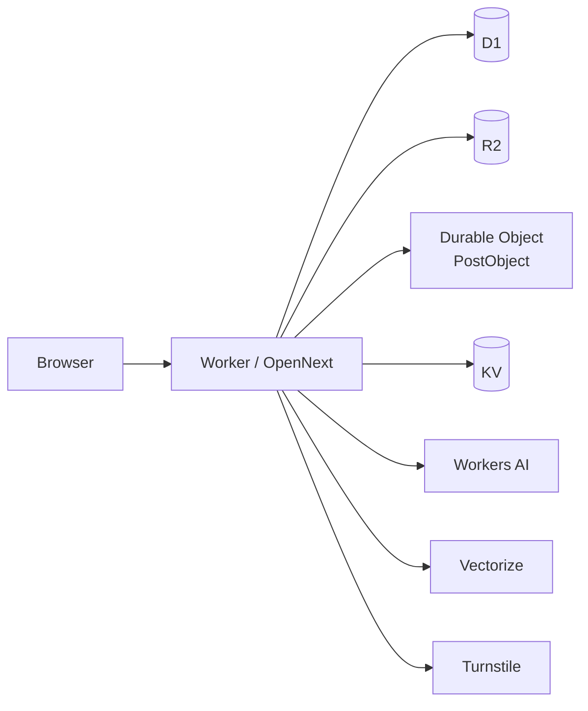

# Việt tại Hàn

Một nền tảng cộng đồng dành cho người Việt tại Hàn Quốc, chạy **hoàn toàn trên Cloudflare**.

Không cần máy chủ ứng dụng riêng, PostgreSQL bên ngoài hay tài khoản S3 ở nền tảng khác. Ứng dụng, cơ sở dữ liệu, tệp phương tiện, AI, vector tìm kiếm, chống bot và giới hạn tốc độ biên đều chạy trên mạng Cloudflare.

Trang chính: **[vth.kr](https://vth.kr)**

Được xây dựng end-to-end với [Cursor](https://cursor.com) (AI pair-programming), dưới sự định hướng của con người về kiến trúc và sản phẩm.


**[Watch the walkthrough →](https://www.youtube.com/watch?v=mexvSvUr52c)**

> **Mã nguồn + hướng dẫn triển khai.** Fork repository này rồi triển khai instance riêng trên Cloudflare.

---

## Why this exists

1. **Cloudflare as the whole backend** — Workers are versatile enough for a real social app: SSR UI, APIs, stateful coordination, SQL, object storage, embeddings, and abuse controls.
2. **Modern AI-assisted engineering** — most of the implementation was written by an agent in Cursor; the result is meant to be readable, deployable, and honest about that workflow.

## Cloudflare stack

| Product | Role in `Việt tại Hàn` |
| --- | --- |
| **Workers** + **OpenNext** | Next.js app + custom edge entry (`src/worker.ts`) |
| **D1** | Primary SQL database (users, posts, votes, DMs, …) |
| **R2** | Media uploads |
| **Durable Objects** | Per-post vote aggregation (`PostObject`) |
| **KV** *(optional)* | Edge cache / challenge state (falls back to memory) |
| **Vectorize** + **Workers AI** | Post embeddings, recommendations, translation |
| **Workers Rate Limiting** | Cheap IP flood gates *before* Next/SSR |
| **Turnstile** | Human checks on auth and write paths |
| **Workers Logs** | Observability (`observability` in `wrangler.jsonc`) |



## Features

- Communities, posts, comments, votes, profiles
- Auth ([Better Auth](https://www.better-auth.com) with Facebook/Zalo/Kakao OAuth and explicit account linking)
- Search and AI-backed recommendations
- Direct messages and notifications
- Media uploads (R2)
- Ads + post analytics (default off until consent and policy approval)
- Consent controls, Pro entitlements, signed billing webhook, transaction/reputation ledgers
- Achievements, reputation, badges, tags
- Content translation via Workers AI
- Sealed Protobuf API tunnel (`/i/api`) with bot / PoW challenges
- Personal API keys

## Quick start (local)

Prerequisites: **Node 22+**, a Cloudflare account (AI / Vectorize are remote; D1 works locally).

```bash
git clone https://github.com/officialjaykoo/viet-tai-han.git
cd viet-tai-han
npm ci
cp .dev.vars.example .dev.vars

npm run db:reset:local   # migrate + seed demo data
npm run dev              # http://localhost:3000
```

Local auth is social-only. Set at least one provider's ID and secret in `.dev.vars` before signing up; seeded demo credentials are not accepted.

Turnstile test keys in `.dev.vars.example` always pass locally. Replace them with your own widget keys for production.

### Useful scripts

| Script | Purpose |
| --- | --- |
| `npm run dev` | Next.js + Cloudflare bindings via OpenNext for Dev |
| `npm run preview` | OpenNext build + local Workers preview |
| `npm run deploy` | Build and deploy the Worker |
| `npm test` | Unit + Workers/integration tests |
| `npm run test:e2e:chromium` | Playwright smoke (Chromium) |
| `npm run db:migrate:local` | Apply D1 migrations locally |
| `npm run vectors:create` | Create the Vectorize index (remote) |

### Multilingual AI

Post recommendations use Cloudflare Workers AI [`@cf/google/embeddinggemma-300m`](https://developers.cloudflare.com/workers-ai/models/embeddinggemma-300m/), a multilingual embedding model that keeps the existing 768-dimensional cosine Vectorize index. New vectors carry an `embeddingVersion` metadata value; create its metadata index before backfilling:

```bash
npx wrangler vectorize create-metadata-index vth-posts --property-name=embeddingVersion --type=string
```

Content translation uses [`@cf/meta/m2m100-1.2b`](https://developers.cloudflare.com/workers-ai/models/m2m100-1.2b/). Vietnamese and Korean posts are translated for the other supported locale; English and Russian posts use Vietnamese as the default target. Translation and embedding jobs are backgrounded and fall back to the regular feed when Workers AI or Vectorize is unavailable.

### Monetization safety

The monetization foundation is implemented without pretending that a payment provider is configured:

- `ads_enabled` is seeded as `0`. An administrator may set it to `1` only after policy, consent, targeting scope, and anti-fraud review.
- Analytics and ad-event storage are opt-in. Impression events require signed-in analytics consent, active campaign/window checks, per-user/day dedupe, and rate limits. Pro entitlements remove feed ads.
- `POST /api/billing/webhook` accepts only a provider-neutral normalized event signed with HMAC-SHA256 in `X-VTH-Billing-Signature` (raw hex, or `sha256=<hex>`). It stores the payload hash and idempotently updates `pro_subscriptions`, `billing_events`, and `transaction_ledger`; raw provider payloads are not stored.
- The webhook contract expects `BILLING_WEBHOOK_SECRET` and an adapter that maps the provider payload to an internal `userId`. Checkout, prices, refunds, tax handling, and provider credentials remain an operator task; no payment flow is enabled by default.


## Deploy your own
For the current `vth.kr` production setup, use the Korean runbook [`docs/CLOUDFLARE_VTH_KR_SETUP.md`](docs/CLOUDFLARE_VTH_KR_SETUP.md). The target account, R2 subscription, `vth-media` bucket, D1, Vectorize, Turnstile, and Worker deployment are complete. Do not recreate resources unless you are provisioning a separate environment.


1. Create Cloudflare resources:

   ```bash
   npx wrangler login
   npx wrangler d1 create vth-db
   npx wrangler r2 bucket create vth-media
   npm run vectors:create   # Vectorize index vth-posts (768 dims, cosine)
   npx wrangler vectorize create-metadata-index vth-posts --property-name=embeddingVersion --type=string
   npx wrangler vectorize create-metadata-index vth-posts --property-name=authorId --type=string
   # optional:
   npx wrangler kv namespace create CACHE
   npx wrangler kv namespace create CACHE --preview
   ```

2. Paste the returned IDs into `wrangler.jsonc` (`database_id`, and KV ids if used).

3. Set `vars.BETTER_AUTH_URL` to the public origin, put the Turnstile **site** key in `vars.NEXT_PUBLIC_TURNSTILE_SITE_KEY`, and configure at least one of `FACEBOOK_CLIENT_ID`, `ZALO_APP_ID`, or `KAKAO_CLIENT_ID`. Set `VTH_AUTH_ORIGINS` only for additional comma-separated preview origins. For browser push, set the VAPID public key in `vars.VAPID_PUBLIC_KEY`.

4. Register the OAuth callbacks with each provider:

   - Facebook: `https://YOUR_ORIGIN/api/auth/callback/facebook`
   - Zalo: `https://YOUR_ORIGIN/api/auth/oauth2/callback/zalo`
   - Kakao: `https://YOUR_ORIGIN/api/auth/callback/kakao`

5. Set secrets:

   ```bash
   wrangler secret put BETTER_AUTH_SECRET
   wrangler secret put TURNSTILE_SECRET_KEY
   wrangler secret put FACEBOOK_CLIENT_SECRET  # when Facebook is enabled
   wrangler secret put ZALO_APP_SECRET          # when Zalo is enabled
   wrangler secret put KAKAO_CLIENT_SECRET     # only when enabled in Kakao
   wrangler secret put VAPID_PRIVATE_KEY       # when browser push is enabled
   wrangler secret put VAPID_SUBJECT           # mailto: or https: contact URI
   wrangler secret put BILLING_WEBHOOK_SECRET  # required only when a provider webhook is enabled
   ```

   All three VAPID values (`VAPID_PUBLIC_KEY`, `VAPID_PRIVATE_KEY`, and `VAPID_SUBJECT`) are required to enable push. The site must run on HTTPS (localhost is allowed by browsers); subscriptions can be managed under Settings → Notifications.
   Facebook and Zalo remain disabled unless both the provider ID and secret are present. Kakao requires `KAKAO_CLIENT_ID`; its client secret is optional unless enabled in Kakao Developers. After signing in with any provider, link the others under Settings → Account → Connected accounts. Email/password and passkey authentication are disabled.
   The billing webhook is not a checkout implementation. Configure a provider adapter, user mapping, prices, refunds, and tax policy before setting `ads_enabled=1` or accepting real payments.

6. Apply remote migrations, then deploy:

   ```bash
   npx wrangler d1 migrations apply DB --remote
   npm run deploy
   ```

7. `wrangler.jsonc` configures `vth.kr` as a Custom Domain; run the deploy after the zone is active and verify it under Workers → Domains & Routes. Use the dashboard Add → Custom Domain flow only if the automatic trigger update fails.

### Production notes

- **`NEXT_PUBLIC_*` is baked at build time.** Keep `.env.local` / build env aligned with the Turnstile site key in `wrangler.jsonc` before `npm run deploy`.
- **Speed Brain** (zone Speed → Optimization) injects speculative prefeches that Cloudflare refuses for Worker routes (`cf-speculation-refused` → cosmetic Network-tab 503). Real navigations still return 200. Turn Speed Brain **off** for Worker apps if the noise bothers you.
- Profile achievement sync is backgrounded for public views so Link-prefetch storms don’t burn Worker CPU.

## Architecture notes

- **Single Worker** — OpenNext handler and `PostObject` ship together from `src/worker.ts`.
- **Edge rate limits first** — floods die before SSR/D1/AI can run.
- **D1 + Kysely** — schema in `migrations/`; access via `src/lib/db.ts`.
- **Security** — Turnstile, signed human cookies, challenge / PoW, sealed `/i/api` under `src/lib/security/` and `src/lib/internal-api/`.

## Tests & CI

GitHub Actions (`.github/workflows/ci.yml`) runs local D1 migrate/seed, typecheck, Vitest (unit + workers), and Playwright Chromium.

```bash
npm test
npm run test:e2e:install
npm run test:e2e:chromium
```

## Built with

- [Next.js](https://nextjs.org) · [OpenNext Cloudflare](https://opennext.js.org/cloudflare)
- [Better Auth](https://www.better-auth.com) · [Kysely](https://kysely.dev) · [Tailwind CSS](https://tailwindcss.com)
- [Wrangler](https://developers.cloudflare.com/workers/wrangler/) · [Vitest](https://vitest.dev) · [Playwright](https://playwright.dev)
- [Cursor](https://cursor.com) — primary implementation workflow

## License

MIT — see [LICENSE](./LICENSE).
