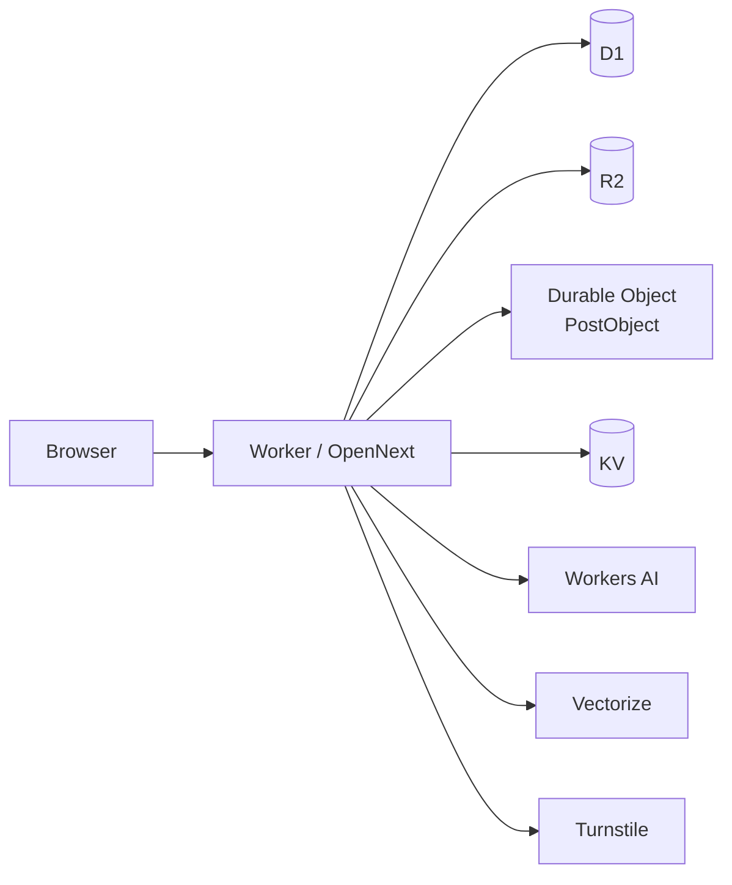

# red

A Reddit-style community platform that runs **entirely on Cloudflare**.

No separate app servers. No managed Postgres elsewhere. No S3 account on another cloud. The app, database, media, AI, search vectors, bot protection, and edge rate limits all live on Cloudflare’s network.

Built end-to-end with [Cursor](https://cursor.com) (AI pair-programming), with human steering on architecture and product direction — a practical example of shipping a full product without leaving Cloudflare’s platform.

[](https://www.youtube.com/watch?v=mexvSvUr52c)

**[Watch the walkthrough →](https://www.youtube.com/watch?v=mexvSvUr52c)**

> **Source + deploy instructions.** Fork it and deploy your own instance on Cloudflare.

---

## Why this exists

1. **Cloudflare as the whole backend** — Workers are versatile enough for a real social app: SSR UI, APIs, stateful coordination, SQL, object storage, embeddings, and abuse controls.
2. **Modern AI-assisted engineering** — most of the implementation was written by an agent in Cursor; the result is meant to be readable, deployable, and honest about that workflow.

## Cloudflare stack

| Product | Role in `red` |
| --- | --- |
| **Workers** + **OpenNext** | Next.js app + custom edge entry (`src/worker.ts`) |
| **D1** | Primary SQL database (users, posts, votes, DMs, …) |
| **R2** | Media uploads |
| **Durable Objects** | Per-post vote aggregation (`PostObject`) |
| **KV** *(optional)* | Edge cache / challenge state (falls back to memory) |
| **Vectorize** + **Workers AI** | Post embeddings, recommendations, translation |
| **Workers Rate Limiting** | Cheap IP flood gates *before* Next/SSR |
| **Turnstile** | Human checks on auth and write paths |
| **Workers Logs** | Observability (`observability` in `wrangler.jsonc`) |



## Features

- Communities, posts, comments, votes, profiles
- Auth ([Better Auth](https://www.better-auth.com)) with email/password + username
- Search and AI-backed recommendations
- Direct messages and notifications
- Media uploads (R2)
- Ads + post analytics
- Admin / moderation tools
- Achievements, karma, badges, tags
- Content translation via Workers AI
- Sealed Protobuf API tunnel (`/i/api`) with bot / PoW challenges
- Personal API keys

## Quick start (local)

Prerequisites: **Node 22+**, a Cloudflare account (AI / Vectorize are remote; D1 works locally).

```bash
git clone https://github.com/koval01/red.git
cd red
npm ci
cp .dev.vars.example .dev.vars

npm run db:reset:local   # migrate + seed demo data
npm run dev              # http://localhost:3000
```

Seeded demo login (local only): `alice` / `password123`

Turnstile test keys in `.dev.vars.example` always pass locally. Replace them with your own widget keys for production.

### Useful scripts

| Script | Purpose |
| --- | --- |
| `npm run dev` | Next.js + Cloudflare bindings via OpenNext for Dev |
| `npm run preview` | OpenNext build + local Workers preview |
| `npm run deploy` | Build and deploy the Worker |
| `npm test` | Unit + Workers/integration tests |
| `npm run test:e2e:chromium` | Playwright smoke (Chromium) |
| `npm run db:migrate:local` | Apply D1 migrations locally |
| `npm run vectors:create` | Create the Vectorize index (remote) |

## Deploy your own

1. Create Cloudflare resources:

   ```bash
   npx wrangler login
   npx wrangler d1 create red-db
   npx wrangler r2 bucket create red-media
   npm run vectors:create   # Vectorize index red-posts (768 dims, cosine)
   # optional:
   npx wrangler kv namespace create CACHE
   npx wrangler kv namespace create CACHE --preview
   ```

2. Paste the returned IDs into `wrangler.jsonc` (`database_id`, and KV ids if used).

3. Set `vars.BETTER_AUTH_URL` to your public origin and put your Turnstile **site** key in `vars.NEXT_PUBLIC_TURNSTILE_SITE_KEY`.

4. Add that same origin to `trustedOrigins` in `src/lib/auth.ts`.

5. Set secrets:

   ```bash
   wrangler secret put BETTER_AUTH_SECRET
   wrangler secret put TURNSTILE_SECRET_KEY
   ```

6. Apply remote migrations, then deploy:

   ```bash
   npx wrangler d1 migrations apply DB --remote
   npm run deploy
   ```

7. Attach a custom domain in the dashboard (Workers → Domains & Routes), or use `*.workers.dev`.

### Production notes

- **`NEXT_PUBLIC_*` is baked at build time.** Keep `.env.local` / build env aligned with the Turnstile site key in `wrangler.jsonc` before `npm run deploy`.
- **Speed Brain** (zone Speed → Optimization) injects speculative prefeches that Cloudflare refuses for Worker routes (`cf-speculation-refused` → cosmetic Network-tab 503). Real navigations still return 200. Turn Speed Brain **off** for Worker apps if the noise bothers you.
- Profile achievement sync is backgrounded for public views so Link-prefetch storms don’t burn Worker CPU.

## Architecture notes

- **Single Worker** — OpenNext handler and `PostObject` ship together from `src/worker.ts`.
- **Edge rate limits first** — floods die before SSR/D1/AI can run.
- **D1 + Kysely** — schema in `migrations/`; access via `src/lib/db.ts`.
- **Security** — Turnstile, signed human cookies, challenge / PoW, sealed `/i/api` under `src/lib/security/` and `src/lib/internal-api/`.

## Tests & CI

GitHub Actions (`.github/workflows/ci.yml`) runs local D1 migrate/seed, typecheck, Vitest (unit + workers), and Playwright Chromium.

```bash
npm test
npm run test:e2e:install
npm run test:e2e:chromium
```

## Built with

- [Next.js](https://nextjs.org) · [OpenNext Cloudflare](https://opennext.js.org/cloudflare)
- [Better Auth](https://www.better-auth.com) · [Kysely](https://kysely.dev) · [Tailwind CSS](https://tailwindcss.com)
- [Wrangler](https://developers.cloudflare.com/workers/wrangler/) · [Vitest](https://vitest.dev) · [Playwright](https://playwright.dev)
- [Cursor](https://cursor.com) — primary implementation workflow

## License

MIT — see [LICENSE](./LICENSE).
