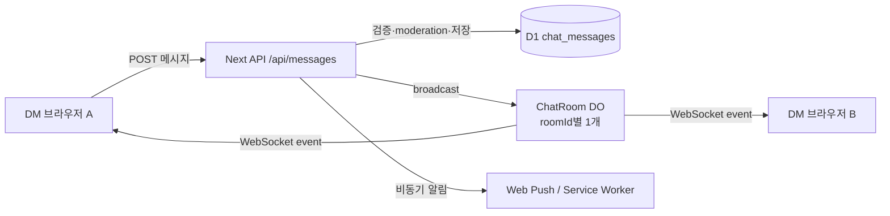

# VTH 실시간 DM

## 상태

VTH DM은 짧은 주기 조회(polling)가 아니라 Cloudflare Durable Object 기반의
hibernatable WebSocket으로 새 메시지를 전달한다.

- D1: 대화방·멤버·메시지의 영속적인 source of truth
- Durable Object: 대화방별 열린 WebSocket 연결 관리와 실시간 fan-out
- Push API: 사이트를 떠난 사용자에게 OS/브라우저 알림 전달
- HTTP API: 인증, rate limit, moderation, 메시지 저장의 canonical write path

## 전체 흐름



## 연결 경로

브라우저는 대화방을 선택하면 다음 경로에 직접 WebSocket upgrade를 요청한다.

```text
ws://localhost:3000/api/messages/realtime?room=<roomId>
wss://example.com/api/messages/realtime?room=<roomId>
```

`src/worker.ts`가 이 경로를 OpenNext보다 먼저 처리한다.

1. `Upgrade: websocket` 요청인지 확인한다.
2. Better Auth 세션 쿠키를 검증한다.
3. 로그인하지 않았거나 차단/정지된 계정이면 거절한다.
4. `CHAT_ROOM.idFromName(roomId)`로 해당 대화방 Durable Object를 찾는다.
5. 검증된 사용자 ID를 내부 헤더로만 전달한다.
6. `ChatRoom`이 D1에서 양쪽 멤버가 active인지, 서로 차단하지 않았는지 재검증한다.
7. 검증 성공 시 hibernatable WebSocket을 수락한다.

브라우저가 보낸 사용자 ID나 room membership을 신뢰하지 않는다. Worker 인증과
Durable Object의 D1 membership 검사를 모두 통과해야 연결된다.

## 메시지 전송

메시지 작성은 기존 HTTP 경로를 유지한다.

```text
POST /api/messages/<roomId>
```

이 경로가 canonical write path인 이유:

- Better Auth 세션 검증
- 메시지 길이 검증
- DM 권한 및 차단 검사
- rate limit
- moderation
- D1 저장
- unread count 갱신
- Web Push 알림

D1 저장이 성공한 뒤 `broadcastChatMessage()`가 해당 room Durable Object에
메시지 이벤트를 전달한다. 연결된 모든 클라이언트는 같은 메시지 ID를 받으며,
클라이언트는 ID로 중복을 제거한다. 브라우저가 보낸 메시지는 HTTP 응답으로도
즉시 화면에 추가되므로 자기 자신의 WebSocket fan-out과 충돌하지 않는다.

WebSocket은 메시지 작성 API가 아니다. 메시지 작성은 계속 HTTP API로 수행하여
기존 보안·moderation 경로를 우회하지 않는다.

## 클라이언트 동작

`src/components/messages/messages-client.tsx`가 다음을 담당한다.

- 대화방 선택 시 기존 HTTP GET으로 초기 메시지 로드
- 같은 room에 WebSocket 연결
- `message` event 수신 즉시 화면에 추가
- 이미 로드된 메시지 ID 중복 제거
- live event 이후 room GET을 event-driven으로 한 번 수행하여 읽음 상태 반영
- 연결 종료 시 exponential backoff 재연결
  - 1초 → 2초 → 4초 → 8초 → 최대 10초
- room 변경 또는 페이지 이탈 시 이전 연결 정리

이 구현에는 새 메시지를 찾기 위한 `setInterval` 조회가 없다. 재연결용
`setTimeout`은 데이터 polling이 아니라 끊어진 WebSocket 연결을 복구하기 위한
backoff timer다. Cloudflare의 WebSocket protocol ping/pong은 런타임이 처리하므로
애플리케이션 heartbeat도 추가하지 않는다.

## Push 알림과 실시간의 차이

두 기능은 목적이 다르다.

| 상황 | 동작 |
|---|---|
| DM 화면을 열어둔 상태 | WebSocket으로 새 메시지가 즉시 화면에 추가 |
| 다른 페이지에 있는 상태 | Push가 활성화되어 있으면 브라우저/OS 알림 수신 |
| 사이트를 닫은 상태 | Push가 활성화되어 있으면 알림 수신 |
| Push를 허용하지 않은 상태 | 메시지는 D1에 저장되고 다음 `/messages` 접속 때 표시 |
| 네트워크 단절 | WebSocket close 감지 후 backoff 재연결 |

Push가 실패해도 메시지 저장과 이후 조회에는 영향이 없다. Push는 VAPID 키,
브라우저 권한, 서비스 워커 구독이 모두 설정되어야 한다.

## Durable Object 설정

`wrangler.jsonc`에 다음 binding과 migration이 등록되어 있다.

```jsonc
{
  "durable_objects": {
    "bindings": [
      {
        "name": "CHAT_ROOM",
        "class_name": "ChatRoom"
      }
    ]
  },
  "migrations": [
    {
      "tag": "v2",
      "new_sqlite_classes": ["ChatRoom"]
    }
  ]
}
```

Worker entry에서 클래스를 export해야 Wrangler가 migration 대상 클래스를
확인할 수 있다.

```ts
import { ChatRoom } from "./workers/ChatRoom";
import { PostObject } from "./workers/PostObject";

export { ChatRoom, PostObject };
```

## 개발·배포 확인

실제 WebSocket upgrade는 custom Cloudflare Worker entry인 `src/worker.ts`에서
처리된다. 따라서 다음 환경에서 확인한다.

```bash
npm run build
npm run preview
```

또는 배포된 Worker에서 확인한다. `npm run dev`는 Next 개발 서버를 직접 실행하므로
custom Worker entry의 WebSocket 라우팅을 거치지 않을 수 있다.

배포 전 확인 항목:

- `CHAT_ROOM` binding 존재
- `ChatRoom` Durable Object migration 반영
- `BETTER_AUTH_SECRET` 설정
- D1에 messaging migrations 적용
- Web Push를 사용할 경우 VAPID 세 값 설정
- 브라우저에서 Push 권한과 구독 활성화

## 구현 파일

- `src/worker.ts`: WebSocket upgrade, Better Auth 검증, DO 라우팅
- `src/workers/ChatRoom.ts`: room별 hibernatable WebSocket과 fan-out
- `src/lib/chat-realtime.ts`: Next API에서 DO broadcast 호출
- `src/app/api/messages/[roomId]/route.ts`: 저장 성공 후 broadcast
- `src/components/messages/messages-client.tsx`: 연결·수신·재연결·중복 제거
- `src/components/notifications/use-unread-count.ts`: polling 없는 event-driven unread 갱신
- `wrangler.jsonc`: production DO binding/migration
- `wrangler.test.jsonc`: Worker 테스트 DO binding/migration
- `tests/workers/chat-room.test.ts`: 연결 인증 전제, fan-out, pending/block 거부 검증
